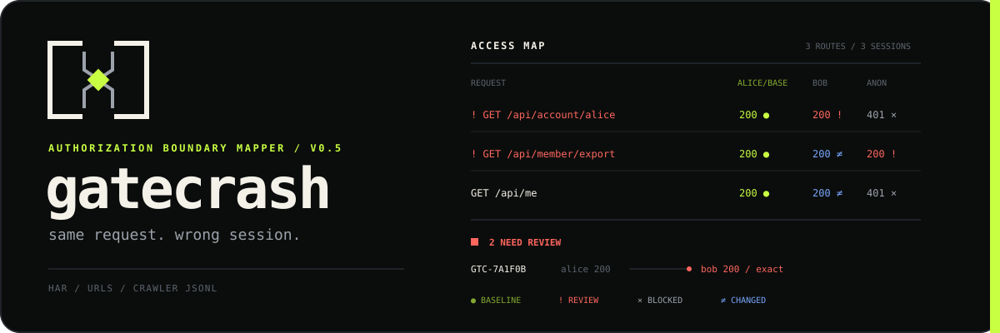

<div align="center">



**Replay a captured request with the wrong session and see what still gets in.**

[](https://github.com/xzycd/gatecrash/actions/workflows/ci.yml)
[](https://nodejs.org/)
[](LICENSE)

</div>

Finding routes is easy. Rechecking them as an admin, a member, and an anonymous
visitor gets old fast.

Gatecrash reads a browser HAR, a URL list, or crawler JSONL. It replays each
eligible request with the sessions in `gatecrash.yml`, fingerprints the
responses, and draws an access map in the terminal. Matching successful
responses become review leads.

Gatecrash does not declare vulnerabilities. HTTP similarity cannot tell you the
application's intended policy, so the final judgment stays with the tester.

## Install

From npm:

```bash
npm install --global @xzycd/gatecrash
gatecrash --version
```

For a stricter install that disables all package lifecycle scripts and pins the
exact release:

```bash
npm install --global --ignore-scripts @xzycd/gatecrash@0.6.0
```

From a Gatecrash checkout:

```bash
npm ci
npm run check
npm install --global .
gatecrash --version
```

The global install is only needed to use `gatecrash` outside this checkout.
During development, `npm run dev -- --help` runs the same CLI directly from the
source tree.

## Try the local lab

```bash
npm install --global @xzycd/gatecrash
gatecrash demo
```

The demo binds to a random loopback port, contains two deliberate authorization
mistakes, and shuts down after the run.

```text
◆╾┫ gatecrash / check

http://127.0.0.1:50641                    3 routes × 3 sessions · 208 ms

ACCESS MAP  3 routes · 3 sessions

REQUEST                                   alice/base  bob         anonymous
──────────────────────────────────────────────────────────────────────────────
! GET /api/account/alice                  200 ●       200 !       401 ×
! GET /api/member/export                  200 ●       200 ≠       200 !
  GET /api/me                             200 ●       200 ≠       401 ×

● baseline  ! review  × blocked  ≠ changed  ? inconclusive

2 NEED REVIEW

! GTC-7A1F0B HIGH GET /api/account/alice
  alice 200 ─────── bob 200 exact match
  bob received the same successful response as alice.

! GTC-B0BB10 HIGH GET /api/member/export
  alice 200 ─────── anonymous 200 exact match
  anonymous received the same successful response as alice.

2 REVIEW  2 BLOCKED  2 CHANGED  0 ERRORS  2 SKIPPED
next    gatecrash explain GTC-7A1F0B
```

The port and timing change on each run. The rest comes from the current demo.

## A real run

Start with a config:

```bash
gatecrash init
```

```yaml
target:
  origin: https://app.example.test
  requests_per_second: 2
  concurrency: 4

profiles:
  admin:
    level: 100
    headers:
      Authorization: "Bearer ${ADMIN_TOKEN}"

  member:
    level: 10
    headers:
      Authorization: "Bearer ${MEMBER_TOKEN}"

  anonymous:
    level: 0

compare:
  baseline: admin
  against: [member, anonymous]
  similarity_threshold: 0.92

exclude:
  paths: [/health, /assets/**]
```

Preview the scope before sending traffic:

```bash
gatecrash inspect session.har
```

`inspect` reads the config without resolving session secrets. It shows the
target, allowed methods, routes, skipped requests, and total replay count. It
does not make network requests.

Run the comparison when the preview looks right:

```bash
ADMIN_TOKEN=... MEMBER_TOKEN=... gatecrash check session.har
```

Open the evidence for one result:

```bash
gatecrash explain GTC-7A1F0B
```

These commands are not simulated: `check` loads the capture and configuration,
sends the in-scope requests to the exact configured origin with each profile,
and compares the responses it receives. Use it only on a system you own or have
permission to test.

## Update from GitHub

Check the latest stable GitHub release without changing the installation:

```bash
gatecrash update --check
```

Install it, or select a particular stable release:

```bash
gatecrash update
gatecrash update 0.6.0
```

Gatecrash accepts only stable releases published under `xzycd/gatecrash`, then
asks npm for that exact package version with install scripts disabled. npm
checks the registry archive integrity, and published releases carry provenance
back to the GitHub workflow. Installing an older release requires `--force`.

## Capture formats

HAR files work directly. Export one from the browser network panel or your
proxy.

A plain URL file can include an optional method:

```text
https://app.example.test/api/me
GET https://app.example.test/api/admin/users
HEAD https://app.example.test/downloads/report
```

JSONL accepts `url`, `endpoint`, `request.url`, or `request.endpoint`. Common
crawler output, including Katana JSONL, does not need a conversion script.

Query values are replayed but never printed or saved. The access map shows query
names only, such as `/search?q&page`.

## Reading the map

Each cell includes a status code and a symbol, so the result still reads with
color disabled.

| Symbol | Outcome | Meaning |
|---:|---|---|
| `●` | baseline | The configured baseline response. |
| `!` | review | A lower or equal profile received a matching successful response. |
| `×` | blocked | The challenger received a redirect, `401`, `403`, or `404`. |
| `≠` | changed | Both sessions succeeded, but their response bodies differ. |
| `=` | same | The bodies match, but the challenger has a higher configured level. |
| `?` | inconclusive | The baseline failed or the challenger returned another status. |

JSON uses stable key ordering and replaces configured volatile values. HTML is
parsed and compared through visible text plus tag structure. Plain text uses
token overlap. Binary bodies use SHA-256.

See [docs/checks.md](docs/checks.md) for the classification rules and
[docs/report-schema.md](docs/report-schema.md) for saved output.

## Safety model

Gatecrash is for systems you own or have permission to test.

- Every replay must match `target.origin` exactly.
- Embedded credentials in target and capture URLs are rejected.
- Captured custom headers are discarded. Only `Accept`, `Accept-Language`, and
  `Content-Type` survive ingestion.
- Authorization headers, cookies, and other session values come from the config.
  Environment variables are resolved only when a check starts.
- `Host`, `Content-Length`, hop-by-hop headers, raw cookie headers, and header
  values containing control characters are rejected in profiles.
- Only `GET`, `HEAD`, and `OPTIONS` run by default.
- Redirects are recorded but never followed.
- Responses are capped at 1 MB by default.
- Capture files are capped at 100 MB and 100,000 entries. A check is capped at
  100,000 replay requests so an accidental export cannot become an unbounded
  run.
- Reports contain no request headers, response headers, cookies, tokens, request
  bodies, response bodies, or query values.
- Report files are replaced atomically and use mode `0600` where the platform
  supports it.

Allow another method only after checking its side effects:

```bash
gatecrash inspect session.har --allow-method POST
gatecrash check session.har --allow-method POST
```

## Scripts and CI

```bash
gatecrash check session.har --format json --no-save
gatecrash check session.har --format markdown --out report.md
gatecrash check session.har --plain --fail-on-review
gatecrash inspect session.har --format json
```

Exit codes are stable:

- `0` means the command completed.
- `1` means the command could not complete.
- `2` means a check completed with review results and `--fail-on-review` was set.

The live interface renders inline. It does not use the alternate screen or clear
scrollback. Non-TTY output switches to plain text, and JSON stdout contains JSON
only.

## Current limits

One run has one baseline profile. Gatecrash does not refresh sessions, execute a
login flow, crawl a browser, or infer business policy. Raw exchanges stay in the
original browser or proxy capture because saved reports are deliberately
sanitized. Configuration accepts up to 64 profiles and rejects unknown setting
names so misspellings do not silently weaken a run.

## Develop

```bash
git clone https://github.com/xzycd/gatecrash.git
cd gatecrash
npm install
npm run check
npm run demo
```

The test suite covers config parsing, capture sanitization, scope enforcement,
fingerprinting, classification, report privacy, the terminal surface, the CLI
process, and a complete run against the loopback lab. Read
[CONTRIBUTING.md](CONTRIBUTING.md) before changing the report schema or replay
behavior.

## License

MIT. See [LICENSE](LICENSE).
